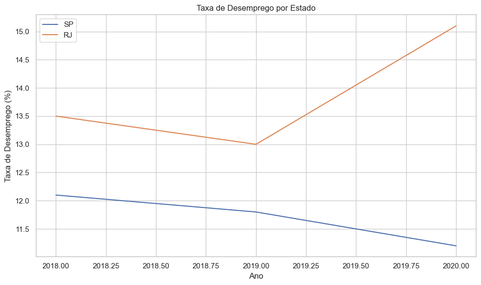

# 📊 Análise da Taxa de Desemprego por Estado

Este projeto demonstra como carregar, tratar e visualizar dados sobre a **taxa de desemprego por estado e por ano**, utilizando Python e bibliotecas voltadas à análise de dados.

## 🔧 Tecnologias utilizadas
- Python
- Pandas
- Matplotlib
- Seaborn
- Jupyter Notebook

## 📁 Dados
Os dados utilizados neste exemplo são simulados, mas representam a estrutura de uma base com:
- Ano
- Estado (sigla)
- Taxa de desemprego (%)

> Arquivo: `desemprego_estados.csv`

## 📈 Objetivo
Exercitar a análise e visualização de dados temporais (evolução ao longo dos anos) por unidade federativa, usando gráficos de linha.

## 📷 Gráfico gerado



## 🚀 Como executar

1. Clone este repositório:
   ```bash
   git clone https://github.com/seu-usuario/nome-do-repo.git

2. Instale as bibliotecas necessárias:
   ```bash
   pip install pandas matplotlib seaborn

3. Execute o Jupyter Notebook:
   ```bash
   jupyter notebook

4. Abra o arquivo analise_desemprego_csv.ipynb e execute as células.
